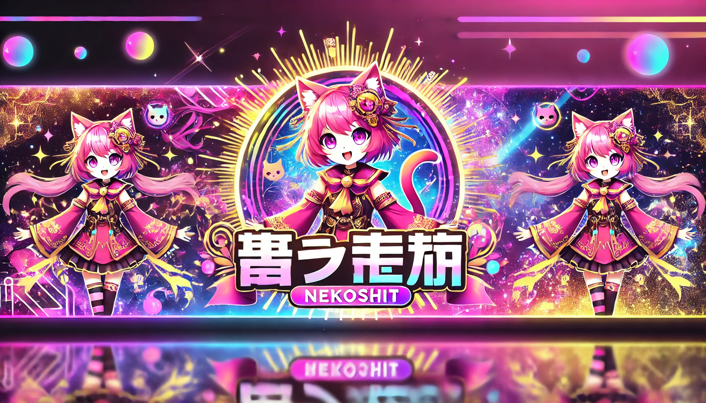
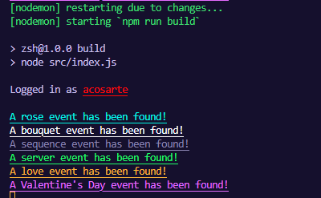

# 🐱 NekoShit Selfbot

  

🚀 **NekoShit Selfbot** is a selfbot designed to manage all Nekotina events without manual intervention.

✅ **Automatically farm**.  
✅ **Send your pet to explore**.  
✅ **Performs all game tasks for you**.  

---

## 📥 Installation  

To install the bot, follow these steps:   

```bash
# Clone the repository
git clone https://github.com/unitedss/NekoShit.git
cd NekoShit

# Install the dependencies
npm install
```

### Configuration   
1. Create a `.env` file in the project root.   
2. Add your Discord token:  
   ```
   TOKEN=YOUR_DISCORD_TOKEN
   ```
3. Save and close the file.  

---

## 🚀 Usage  

To start the bot, use:  

```bash
node src/index.js
```

If you want to keep it running without interruptions, use the script: **dev**  

```bash
npm run dev
```

---

## 🛠 Features    

🔹 **100% Automatic** – You don't need to be present.    
🔹 **Complete Event Management** – Takes care of farming, exploring and more.  
🔹 **Optimization and Updates** – It is constantly improving.  

---

## 📷 Preview    

  

---

## 🤝 Contributions    

Contributions are welcome! If you have ideas or find bugs, open an issue or make a pull request.  

📩 Contact: [Your Discord / Twitter / Web]  

---

## 📝 License    

This project is licensed under the [MIT](LICENSE).  

---

© 2024 NekoShit Selfbot - Made with ❤️ for the community.
